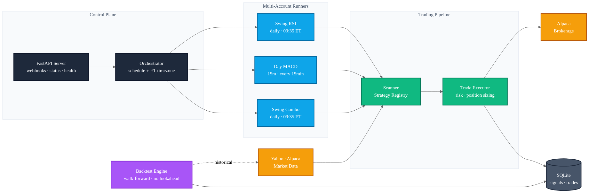

# Autonomous Stock Trading System



End-to-end automated equities trading platform: scans the market on a schedule, generates signals from technical strategies, executes trades through the Alpaca brokerage, and reports performance — runnable in paper or live mode, on a laptop or a $7/month cloud VM.

The system is structured as a single-process orchestrator that supervises any number of independently-configured trading accounts (each with its own strategy, risk profile, and broker credentials), backed by a FastAPI control plane and a walk-forward backtest engine for offline strategy evaluation.

## Highlights

- **Pluggable strategy architecture.** Strategies register themselves through a decorator (`@StrategyRegistry.register("rsi")`) and implement a small interface (`validate_signal`, `should_execute`, `prepare_order`). Five strategies ship out of the box (RSI, MACD, MA crossover, Bollinger Bands, RSI+MACD combo); adding a new one is a single file.
- **Multi-account orchestrator.** A single process drives N accounts, each scheduled independently — *swing* accounts scan daily bars at 09:35 ET, *day* accounts scan 15-minute bars every 15 minutes during market hours and close all positions at 15:55 ET. Per-account API keys, risk limits, and strategy parameters are configured declaratively in YAML with `${ENV_VAR}` references.
- **Walk-forward backtest engine.** Time-ordered simulation across all symbols with no lookahead bias — at bar *N*, only bars `[0..N]` are visible to the strategy, and portfolio constraints (max positions, capital, position sizing) are enforced in real time as the simulation advances. Includes side-by-side comparison mode for evaluating multiple strategies on the same window.
- **Three position-sizing modes.** `portfolio` (fixed % of total equity), `buying_power` (fixed % of available cash), and `adaptive` — which picks the smaller of the two and respects a configurable buying-power reserve so fees and slippage don't push orders into rejection.
- **Production-style operational design.** Structured JSON logging (`structlog`), Pydantic-validated settings with separate live/paper validation paths, HMAC webhook signature validation, automatic stale-order cleanup, Alembic migrations, domain-specific exceptions (`BrokerError`, `RiskLimitError`, `ValidationError`), and a systemd unit for 24/7 operation on GCP.
- **Honest about timezones.** Market-hours and scheduling logic uses `zoneinfo.ZoneInfo("America/New_York")` everywhere — recent commits include a fix for the scheduler that had been firing at UTC, causing the swing scan to never run.

## Architecture

The diagram at the top of this README shows the runtime topology. In short:

- **Control plane** — a FastAPI server exposes webhook, status, trades, and health endpoints; the Orchestrator schedules account runners on ET-aware cron rules.
- **Multi-account runners** — each configured account is an independent runner with its own strategy, risk profile, and Alpaca credentials. Swing accounts wake at 09:35 ET; day accounts run every 15 minutes during market hours and flatten at 15:55 ET.
- **Trading pipeline** — runners feed the Scanner (which evaluates registered strategies against market data) and the Trade Executor (which validates signals, sizes positions, and places orders).
- **External services** — Yahoo Finance and Alpaca for market data; Alpaca for order routing.
- **Persistence** — SQLite by default (signals, trades, snapshots) with Alembic migrations. Swappable for PostgreSQL by changing one connection string.
- **Backtest engine** — offline path that replays the same strategies over historical bars with no lookahead bias and full portfolio constraint enforcement.

The mermaid source for the diagram lives at [`docs/architecture.mmd`](docs/architecture.mmd).

## Tech Stack

**Runtime:** Python 3.13, FastAPI, Uvicorn, SQLAlchemy 2.x, Alembic, Pydantic Settings, `structlog`, `schedule`, `zoneinfo`.

**Market data & execution:** `alpaca-py` (brokerage + historical data), `yfinance` (alternative free data source), `pandas-ta` (technical indicators).

**Testing & quality:** `pytest`, type-annotated throughout, domain-specific exceptions over generic ones.

**Deployment:** Windows (NSSM service or Task Scheduler), Linux (systemd unit on GCP `e2-micro` for ~$8/month).

## Engineering Notes

A few of the design choices that made this interesting to build:

**Multi-account orchestration in one process.** Running each account in its own process would be simpler but burns memory linearly. Instead, the `Orchestrator` holds one `AccountRunner` per configured account and lets the `schedule` library multiplex them on a single thread. Strategy code is pure (no I/O), so cross-account interference is bounded to the broker layer — and Alpaca's per-account API keys naturally isolate orders.

**Backtest realism.** The backtest engine processes all symbols' bars in chronological order rather than per-symbol, so portfolio constraints (`max_positions`, capital available, `min_buying_power`) are enforced *as the simulation advances*. A naive per-symbol backtest reports inflated returns because it implicitly assumes infinite capital — this engine doesn't.

**Adaptive position sizing.** Early versions sized positions as a fixed % of *portfolio value*, which would happily issue orders that exceeded available buying power once cash was tied up in open positions. The `adaptive` mode picks the smaller of (% of portfolio, % of buying power × `1 - reserve_pct`) — which prevents broker rejections without leaving cash idle.

**Live-mode validation.** `app/config.py` runs `validate_live_trading()` at startup if `TRADING_MODE=live`, and refuses to start if the base URL still points at `paper-api.alpaca.markets`. Cheap belt-and-suspenders, but it has caught misconfigured deploys.

**Configuration as code.** Account definitions live in [`accounts.yaml`](accounts.yaml). API keys are referenced as `${ALPACA_API_KEY}` and resolved against the environment at load time — so the YAML is checkable into source control without leaking credentials.

## Status & Disclaimer

This is a personal project, runs in paper mode by default, and is shared as a portfolio piece. It is **not** financial advice, and I make no claims about strategy profitability — the value of the project is in the engineering, not the alpha.

Trading equities involves real risk of loss. Anyone running this in live mode is responsible for their own decisions, regulatory compliance, and risk management.

---

# Developer / Operator Documentation

The remainder of this document covers running the system locally, configuring strategies and risk limits, deploying to a 24/7 host, and extending the codebase.

## Quick Start

### 1. Install Dependencies

```powershell
pip install -r requirements.txt
pip install -r scanner_requirements.txt
```

### 2. Configure API Keys

Copy `.env.example` to `.env` and fill in your Alpaca paper trading keys (free at https://app.alpaca.markets/paper/dashboard/overview):

```env
ALPACA_API_KEY=your_paper_api_key_here
ALPACA_SECRET_KEY=your_paper_secret_key_here
ALPACA_BASE_URL=https://paper-api.alpaca.markets
TRADINGVIEW_WEBHOOK_SECRET=$(python -c "import secrets; print(secrets.token_urlsafe(32))")
```

### 3. (Optional) Download Stock Universe

```powershell
python download_stock_list.py    # writes stock_symbols_top100.txt etc.
```

### 4. Start the System

```powershell
# Single-process multi-account runner (recommended)
python run_trading.py

# Or the legacy two-process layout:
start_all.bat
```

### 5. Monitor

```powershell
python check_trades.py              # recent trades
curl http://localhost:8080/status   # account snapshots
curl http://localhost:8080/docs     # OpenAPI / Swagger UI
```

## Configuration

All runtime knobs live in two places:

- **`.env`** — secrets and global defaults (API keys, default risk limits, log level, scheduler tuning). See [`.env.example`](.env.example) for the full list.
- **`accounts.yaml`** — per-account configuration. Each entry pins an account to one Alpaca key pair, one strategy with its parameters, and its own risk limits.

Example account entry:

```yaml
accounts:
  - id: swing_rsi_1
    name: "Swing RSI"
    type: swing                      # or 'day'
    alpaca_api_key: ${ALPACA_API_KEY}
    alpaca_secret_key: ${ALPACA_SECRET_KEY}
    strategy: rsi
    strategy_params:
      period: 14
      oversold: 30
      overbought: 70
    risk:
      position_size_pct: 0.10
      max_positions: 5
      max_position_size_usd: 10000.0
      min_buying_power: 100.0
      min_trade_size_usd: 50.0
      buying_power_reserve_pct: 0.05
```

**Account types:**

- `swing` — daily bars, scans once per trading day at 09:35 ET.
- `day` — 15-minute bars, scans every 15 minutes during market hours; closes all positions at 15:55 ET.

**Available strategies:** `rsi`, `macd`, `ma_cross`, `bb`, `combo`.

## Backtesting

Run any configured strategy against historical data:

```powershell
python run_backtest.py --account swing_rsi_1 --start 2024-01-01 --end 2024-12-31

# With custom capital and CSV output
python run_backtest.py --account swing_rsi_1 --start 2023-01-01 --end 2024-01-01 \
  --capital 50000 --output results.csv

# Compare multiple strategies on the same window
python run_backtest.py --compare --start 2024-01-01 --end 2024-12-31
```

The engine prints metrics (total return, Sharpe, max drawdown, win rate, trade count) and signal-frequency stats so you can see *why* a strategy did or didn't trade.

## Available Strategies

| Strategy   | Description                                  | Signal frequency  | Risk profile |
| ---------- | -------------------------------------------- | ----------------- | ------------ |
| `rsi`      | RSI mean reversion (oversold/overbought)     | Moderate–high     | Medium       |
| `macd`     | MACD signal-line crossover                   | Low–moderate      | Medium       |
| `ma_cross` | 50/200-day moving average crossover          | Very low          | Low          |
| `bb`       | Bollinger Bands mean reversion               | Moderate–high     | High         |
| `combo`    | RSI + MACD confirmation (most conservative)  | Low               | Low          |

## Adding a Strategy

Two integration points depending on where you want it:

1. **Scanner-side strategy** — used by the scanner to evaluate market data and emit signals. Add to [`scanner/strategies.py`](scanner/strategies.py) by subclassing `TechnicalStrategy` and implementing `analyze(df, symbol) -> dict`.
2. **Server-side execution strategy** — used by the trade executor to validate signals and size orders. Add a class in [`app/strategies/`](app/strategies/) decorated with `@StrategyRegistry.register("name")`, implementing `validate_signal`, `should_execute`, and `calculate_position_size` / `prepare_order`. See [`app/strategies/momentum.py`](app/strategies/momentum.py) as a template.

Strategies are auto-discovered at startup. Reference them in `accounts.yaml` by name.

## API Endpoints

The FastAPI server exposes:

| Endpoint                       | Purpose                                       |
| ------------------------------ | --------------------------------------------- |
| `GET /`                        | System info                                   |
| `GET /health`                  | Liveness probe                                |
| `GET /status`                  | Per-account broker snapshots                  |
| `GET /trades`                  | Recent trades from the database               |
| `POST /webhook/tradingview`    | Trade signal intake (HMAC-validated)          |

Interactive docs at `http://localhost:8080/docs` when the server is running.

### Manual Webhook Test

```bash
curl -X POST http://localhost:8080/webhook/tradingview \
  -H "Content-Type: application/json" \
  -d '{"ticker":"AAPL","action":"buy","strategy":"momentum","price":150.00}'
```

## Deployment

### Linux / GCP (systemd, 24/7)

Detailed instructions in [`DEPLOY_GCP.md`](DEPLOY_GCP.md). Summary: provision a `e2-micro` VM, clone the repo, install dependencies in a venv, drop the provided systemd unit, `systemctl enable --now trading-system`. Total cost ~$8/month.

### Windows (Task Scheduler or NSSM)

Two options:

**Task Scheduler — starts on login:**

1. `Win + R` → `taskschd.msc` → *Create Task*.
2. *Triggers:* At log on.
3. *Actions:* `powershell.exe -ExecutionPolicy Bypass -File "%USERPROFILE%\trading-system\start_trading_persistent.ps1"`.

**NSSM — runs as a Windows service even when logged out:**

```powershell
cd C:\nssm\win64
.\nssm.exe install TradingSystemServer "%USERPROFILE%\AppData\Local\Programs\Python\Python313\python.exe"
.\nssm.exe set TradingSystemServer AppDirectory "%USERPROFILE%\trading-system"
.\nssm.exe set TradingSystemServer AppParameters "run_trading.py"
.\nssm.exe start TradingSystemServer
```

## Operational Tooling

| Script                       | What it does                                            |
| ---------------------------- | ------------------------------------------------------- |
| `run_trading.py`             | Single-process multi-account orchestrator + API server  |
| `run_scanner.py`             | Scanner CLI (legacy two-process mode)                   |
| `run_backtest.py`            | Walk-forward backtest runner with comparison mode       |
| `check_trades.py`            | Print recent trades from the database                   |
| `cancel_all_orders.py`       | Emergency: cancel every open order                      |
| `cleanup_orders_now.py`      | Cancel stale orders manually (auto-runs on scanner boot)|
| `clear_rejected_trades.py`   | Drop rejected rows from the trades table                |
| `reset_database.py`          | Interactive database wipe (filled / pending / all)      |
| `download_stock_list.py`     | Refresh `stock_symbols_*.txt` universe files            |

## Project Layout

```
app/                # FastAPI service: API, executor, broker wrapper, models
  api/              # Webhook + admin endpoints
  core/             # Executor, broker, validator, exceptions
  models/           # SQLAlchemy models (Signal, Trade)
  schemas/          # Pydantic request/response schemas
  services/         # Database, notifier
  strategies/       # Server-side strategy registry & implementations
  utils/            # Logger, helpers
  config.py         # Pydantic Settings with live/paper validation

scanner/            # Market scanner: data sources + scanner-side strategies
trading/            # Multi-account orchestrator, runner, config loader
backtest/           # Walk-forward backtest engine, metrics, reporting
alembic/            # Database migrations
tests/              # Pytest suite
accounts.yaml       # Per-account configuration
.env.example        # Configuration template
```

~5,800 lines of Python.

## Troubleshooting

**Orders showing "Filled Qty: 0.00" on Alpaca.** Pending orders accumulate when the market is closed. Auto-cleanup is on by default (`AUTO_CLEANUP_ORDERS=true`, cancels orders older than `AUTO_CANCEL_ORDER_AGE_HOURS=1`). Force a manual cleanup with `python cancel_all_orders.py`.

**"No signals found".** Normal during quiet markets. Try a different strategy, more symbols, or wait for volatility. Use `python run_scanner.py --dry-run --strategy rsi` to verify the scanner is reaching the data source.

**"Unauthorized".** Wrong or missing Alpaca keys. Re-check `.env` against https://app.alpaca.markets/paper/dashboard/overview.

**"Market is closed".** Paper trading accepts orders 24/7, but they queue until the next session. Enable extended hours with `EXTENDED_HOURS_ENABLED=true` (uses limit orders with a 0.5% buffer).

**Yahoo Finance rate limiting.** Cap scans at 500 symbols and intervals at 15 minutes. If blocked, wait an hour or switch to the Alpaca data source.

## External Documentation

- Alpaca API: https://alpaca.markets/docs/
- `yfinance`: https://github.com/ranaroussi/yfinance
- `pandas-ta`: https://github.com/twopirllc/pandas-ta
